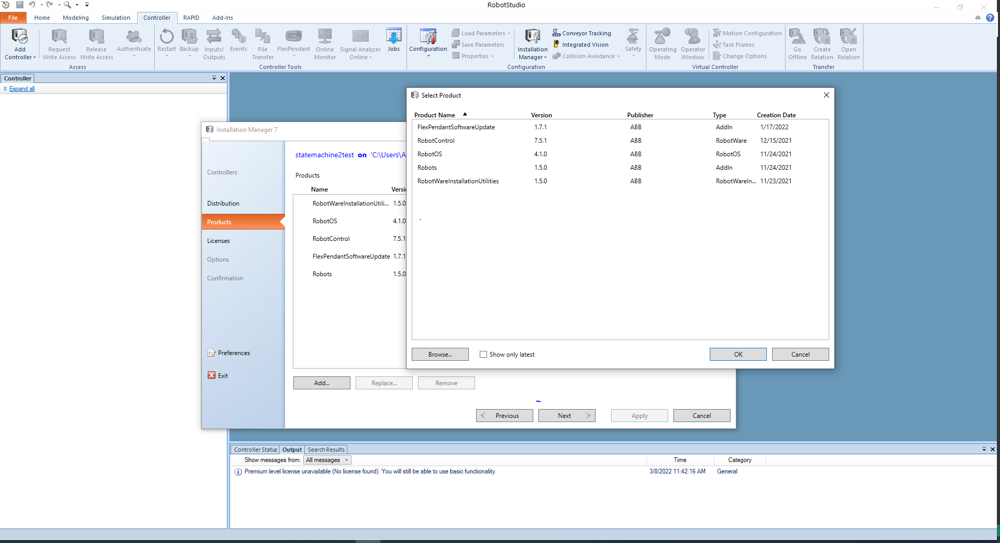
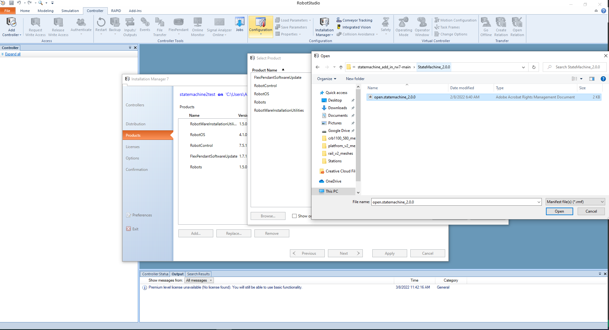

# Statemachine RW7 Add-In

Current implementation is missing Watchdog and SmartGripper capabilities

For installation:
- Clone or download the repository as zip file
- Follow the same [official ABB StateMachine 1.1 installation manual](https://robotapps.blob.core.windows.net/appreferences/docs/cd504500-80e2-4cb6-9419-c60ea4ad6d56UserManual.pdf) using the **Installation Manager 7** from the **Controller** tab.
- In Step 2, use the Browse option to find StateMachine 2.0 from the downloaded repo:

  
   
  <i>Browse the State Machine 2.0 from your local directory.</i>

and then select then select the installation package as shown below:

  
   
  <i>Select the State Machine 2.0 installation file.</i>

The rest of the installation steps are similar to the State Machine 1.1.
